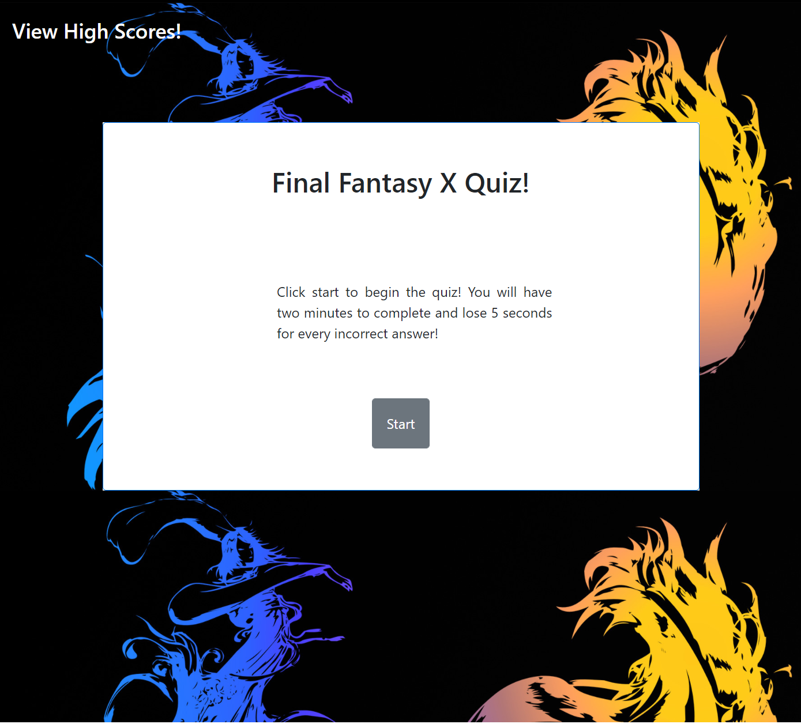
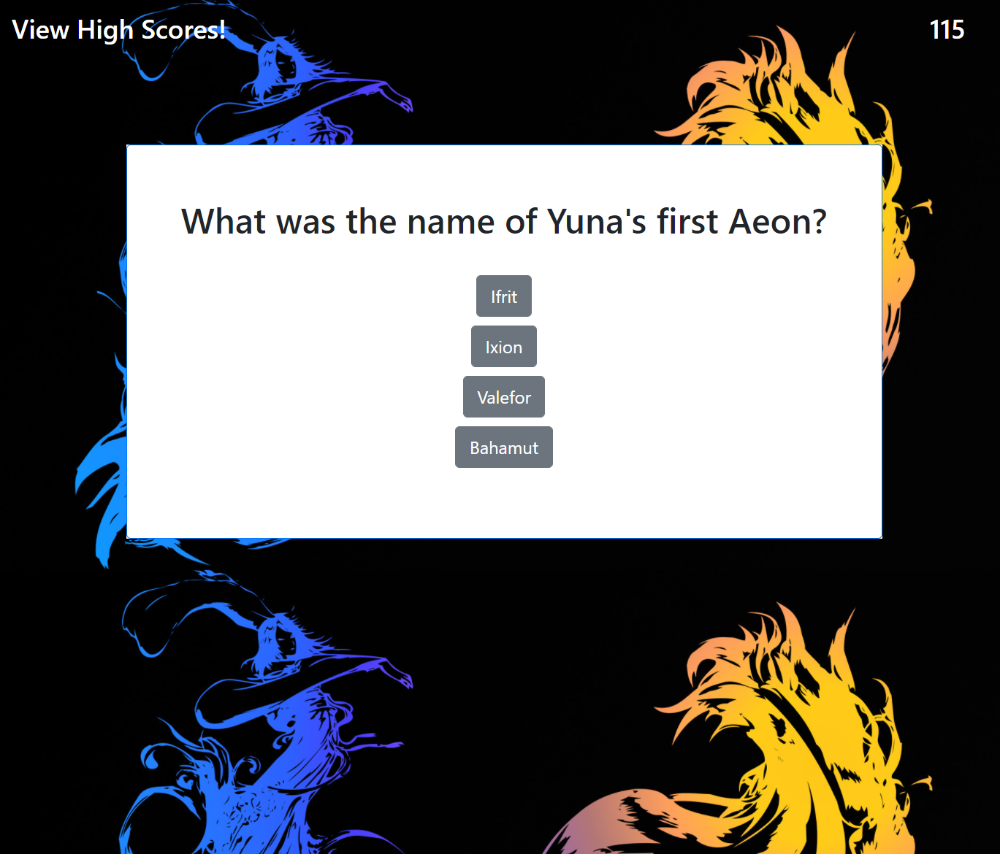
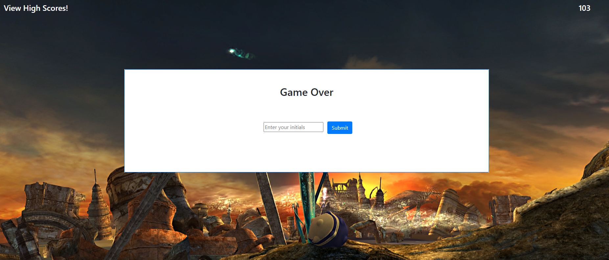

# Final Fantasy X Quiz

## Description
The goal for this project was to build a quiz utilizing JavaScript and HTML. I began this project by developing a grid with a form, buttons, an input field, some text and an h2 tag to be changed into questions as the quiz goes on. The majority of the code that creates and changes the page is in JavaScript. The quiz begins by pressing the start button, which hides the text on the form, hides the start button, shows the four answer buttons, and calls a function to display the next set of questions, as well as activating the timer function and start playing music. The timer is a nested function, which repeats every second until the seconds variable reaches zero. All the questions, answers, and correct answers are stored in an object, which is iterated through to display the questions as text on the four buttons. Using a loop, the content of each question is displayed with the index of a counter, which increases every time a question is checked. Another loop was created to randomize the answer order on each play through. In order to create event handlers for each button, I created a for loop that works by creating as many event handlers as there are buttons. When a button is clicked, the text content of the button is checked against the correct answer of the question, and an if/else statement is used to display correct under the buttons if the answer is correct then go to the next question, or take 5 seconds off the timer and go to the next question if incorrect. When either the timer reaches zero or the user answers all ten questions, the quiz is stopped and the user is asked to enter initials if they would like to save their high score. The high score is then displayed and the user is given the option to restart.

## Table of Contents
* [Installation](#installation)
* [Usage](#usage)
* [Built With](#built_with)
* [Deployed Link](#deployed_link)
* [Author](#author)
* [Images](#images)
* [License](#license)

## Installation
To launch this site, I created a repository on github and utilized github pages to host it.

## Usage
This application is a Final Fantasy X quiz. When the user presses start to begin the quiz, four answers will appear on buttons. Each time the user clicks a button, the next questions will appear along with four new answers. The user is given an option to enter their initials, which will be saved upon clicking submit and then displayed back to them. There is also a button to display high scores in the top left which can be used at any time. From the high score screen, the user may click restart to begin the quiz again.

## Built_With
* JavaScript
* HTML
* CSS
* [Bootstrap CSS Framework](https://getbootstrap.com/)
* [Github](https://github.com/)

## Deployed_Link
[Final Fantasy X Quiz](https://jsp117.github.io/Final-Fantasy-X-Quiz/)

## Author
Jonathan SanPedro - Bachelors of Information Technology Rutgers New Brunswick - Student at Berkeley Coding Bootcamp

* [Github](https://github.com/jsp117)
* [LinkedIn](https://www.linkedin.com/in/jonathan-s-6ab32283/)

## Images

## License

MIT License

Copyright &copy; [2020] [Jonathan J. SanPedro]

Permission is hereby granted, free of charge, to any person obtaining a copy
of this software and associated documentation files (the "Software"), to deal
in the Software without restriction, including without limitation the rights
to use, copy, modify, merge, publish, distribute, sublicense, and/or sell
copies of the Software, and to permit persons to whom the Software is
furnished to do so, subject to the following conditions:

The above copyright notice and this permission notice shall be included in all
copies or substantial portions of the Software.

THE SOFTWARE IS PROVIDED "AS IS", WITHOUT WARRANTY OF ANY KIND, EXPRESS OR
IMPLIED, INCLUDING BUT NOT LIMITED TO THE WARRANTIES OF MERCHANTABILITY,
FITNESS FOR A PARTICULAR PURPOSE AND NONINFRINGEMENT. IN NO EVENT SHALL THE
AUTHORS OR COPYRIGHT HOLDERS BE LIABLE FOR ANY CLAIM, DAMAGES OR OTHER
LIABILITY, WHETHER IN AN ACTION OF CONTRACT, TORT OR OTHERWISE, ARISING FROM,
OUT OF OR IN CONNECTION WITH THE SOFTWARE OR THE USE OR OTHER DEALINGS IN THE
SOFTWARE.

## Acknowledgements
* Pictures and music from Final Fantasy X &copy; [Square Enix](https://www.square-enix.com/)
* [Bootstrap CSS Framework](https://www.getbootstrap.com)
